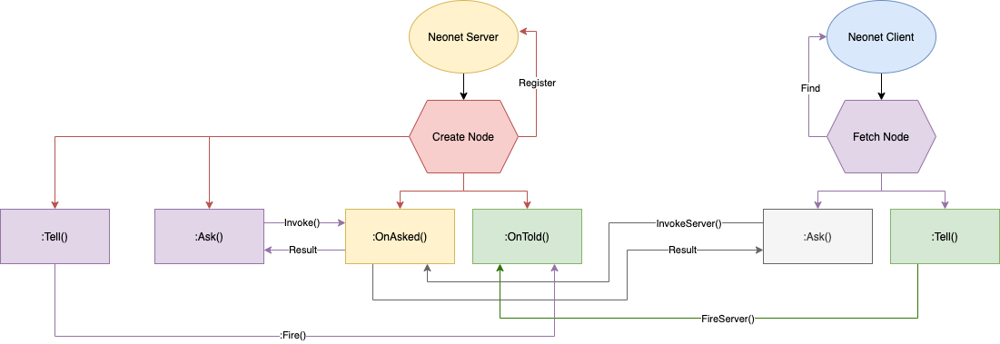

# Neonet v1.0.7
A simplified networking solution for roblox game development that provides a more human readable syntax. 

Created as personal resource, but feel free to use it if you'd like.

This module is in active development, so breaking changes are possible.

<br>

## Table of Contents
  - [What's new?](#whats-new)
  - [Installation Options](#installation-options)
  - [How It Works](#how-it-works)
  - [Usage](#usage)
    - [1. Setup](#1-setup)
    - [2. Create a Node](#2-create-a-node)
    - [3. Fetch a Node](#3-fetch-a-node)
    - [4. `Remote and Bindable Events:` **:Tell()** and **:OnTold()**](#4-remote-and-bindable-events-tell-and-ontold)
    - [5. `Remote and Bindable Functions:` **:Ask()** and **:OnAsked()**](#5-remote-and-bindable-functions-ask-and-onasked)
  - [Support](#support)

<br>

---
## What's new?
- Rewrote system to use the 'Node' feature
- Added runtime flags.

---
## Installation Options
1. Install with [Wally](https://wally.run/package/neohertz/neonet)
2. Download `.rbxm` from [Releases](https://github.com/Neohertz/Neonet/releases/) 

---
## How It Works

Neonet allows developers to create 'Nodes' that automatically handle any traffic depending on the context. The following diagram shows the process and available methods when creating a node on the server, and fetching it from the client 



> ## Note
> 
> The client can create nodes of its own, but these nodes can only be fetched across the client. 
> I may add another diagram at a later date showing this.
---
## Usage
### 1. Setup
> How to first initialize neonet.
>
>   - **Flags:** As of `v1.0.7`, Flags can be set by **calling the module like a function.** (see example)
>       - These can be sent once on the client, once on the server, or both.       
>       - Some lint flags require the flag on both the server and client to function properly.
>
>   - **Available Flags:**
>       - `'lint'` - Lint the network at runtime and warn for any potentially bad practices.

```lua
local Network = require(path.to.neonet) 

Network('lint') -- optional lint flag
```
### 2. Create a Node
> Neonet allows you to create nodes on the client and server. 
> - Quirks
>   - if a node is created on the server, it will be able to cross the client-server boundary. 
>   - If a node is created on the client, it will only be able to be accessed from the client.
>
> Usage:
```lua
local MyNode = Network.CreateNode("MyNode")
```
### 3. Fetch a Node
> If a node has been created outside of our script, we can use **:Fetch()** to grab it.
> 
> Note: *You can fetch a server node from the client or another server script, but you cannot fetch a client node from the server.*
>
> - Quirks
>   - This method *can* yield for up to 5 seconds to await the nodes creation.
>
> Usage:
```lua
local MyNode = Network:Fetch("MyNode")
```
### 4. `Remote and Bindable Events:` **:Tell()** and **:OnTold()**
> Send a message to a node and all of it's listeners.
>
> - Quirks
>   - If :Tell() is called from the node's host (see example), the first argument of the OnTold() callback (Player) will be nil.
>
> Usage:
```lua
--/* Server */--
local Network = require(path.to.neonet) 
local MyNode = Network.CreateNode("MyNode")

MyNode:OnTold(function(Player, Message)
    print (Player, "Says", Message)
end) 

-- Fired from node's host (server)
MyNode:Tell("Hello from Server!")

--/* Client */--
local Network = require(path.to.neonet) 
local MyNode = Network:Fetch("MyNode")

-- Fired from client
MyNode:Tell("Hello from Client!")
```
### 5. `Remote and Bindable Functions:` **:Ask()** and **:OnAsked()**
> - Quirks
>   - If :OnAsked() is called from the node's host (see example), the first argument of the OnAsked() callback (Player) will be nil.
>
> Usage:
```lua
--/* Server */--
local Network = require(path.to.neonet) 
local MyNode = Network.CreateNode("MyNode")

MyNode:OnAsked(function(Player, Message)
    return 'Hello from MyNode!'
end) 

-- Fired from node's host (server)
print(MyNode:Ask()) -- "Hello from MyNode!'

--/* Client */--
local Network = require(path.to.neonet) 
local MyNode = Network:Fetch("MyNode")

-- Fired from client
print(MyNode:Ask()) -- "Hello from MyNode!'
```
---
## Support
Need Help? Shoot me a private message on [Twitter](https://twitter.com/neohertz0)!

Found a bug? Open a [Issue](https://github.com/Neohertz/Neonet/issues)!